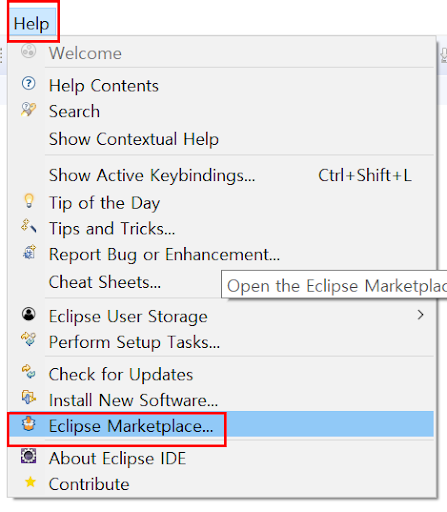
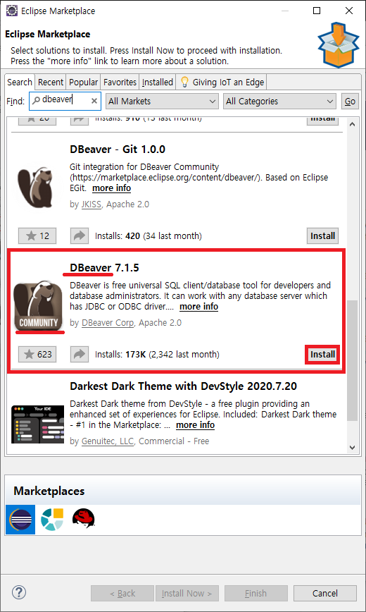
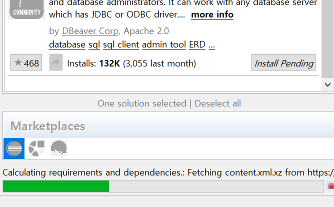
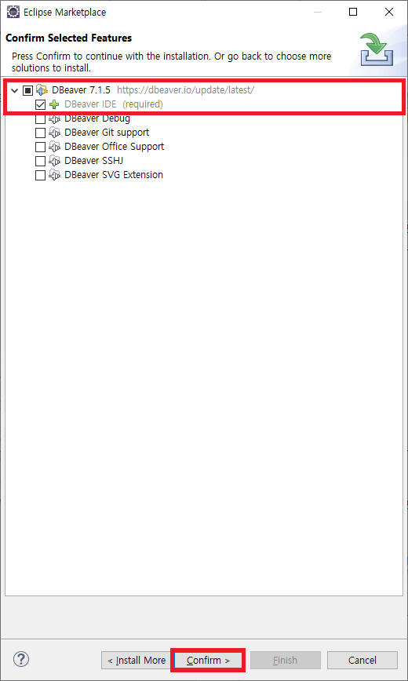
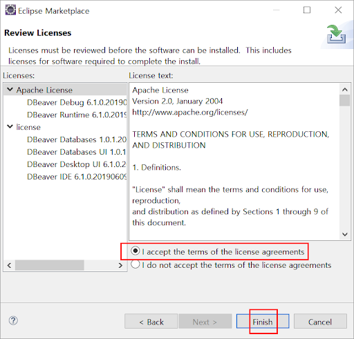
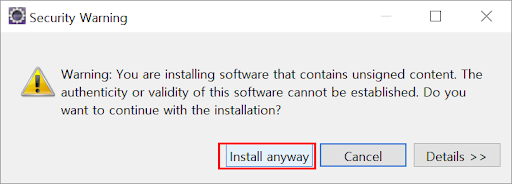
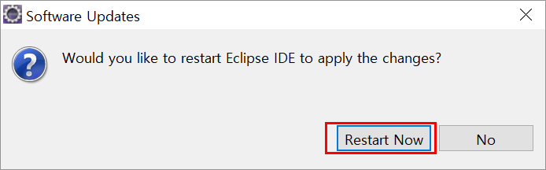

# DBeaver!

이클립스의 기본DatabaseDevelopment 환경의 빈약한 문제

- 최신 DBMS, 다양한 DBMS 지원 느림
- 쿼리 수행속도, 느림.
- 쿼리 Result 화면 빈약

DBeaver 로 극복 가능.

---

## Eclipse MarketPlace 를 통해 설치

DBeaver 최신버젼 Install  
여기서 주의하실 사항이 여러가지 DBeaver가 있는데, community 버전을 받을 수 있도록 합니다.

다운로딩

  
Confirm 를 눌러 진행

I acecept 로 동의 후 finish 진행

이클립스의 하단에서 설치의 진행도를 볼 수 있습니다.

Install anyway로 계속 설치 진행합니다.

Restart Now 로 이클립스를 재시작 합니다.
