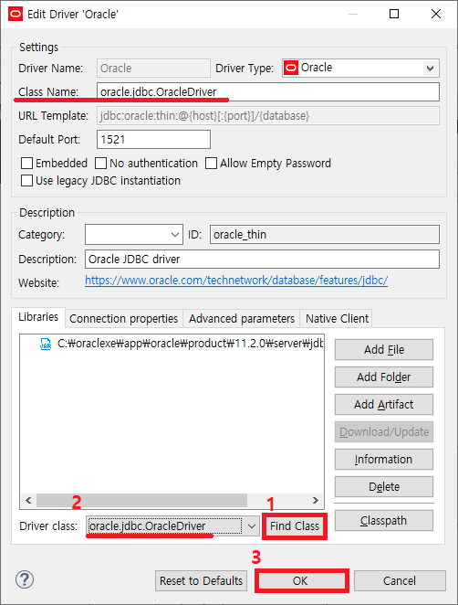

# DBeaver!

이클립스의 기본DatabaseDevelopment 환경의 빈약한 문제

- 최신 DBMS, 다양한 DBMS 지원 느림
- 쿼리 수행속도, 느림.
- 쿼리 Result 화면 빈약

DBeaver 로 극복 가능.

---

## 새로운 메뉴

---

## 드라이버 관리자

드라이버 관리자 세팅은 최초 한번이면 됩니다.  
단! 클라우드 환경으로 여러 컴에서 같은 워크스페이스 운영시 DBMS 설치 경로가 다르면 문제 발생 가능.

> (ex) 오라클의 경우

커서를 잡아 기존의 라이브러리를 delete 합니다.

ADD File 을 눌러 jar 파일을 추가 시켜 줄 수 있도록 합니다.

jar파일을 ADD 했다면, 다음으로 Driver Class 를 잡아줄 수 있도록 합니다.

Find Class 를 한번 눌러 준뒤 2번의 Driver Class 와 위쪽에 있는 Class Name이 맞도록 선택 한뒤 Ok를 눌러 설정 합니다.

설정이 끝났으면 Close로 닫아 줄 수 있도록 합니다.
