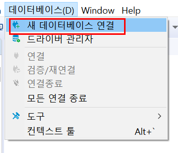
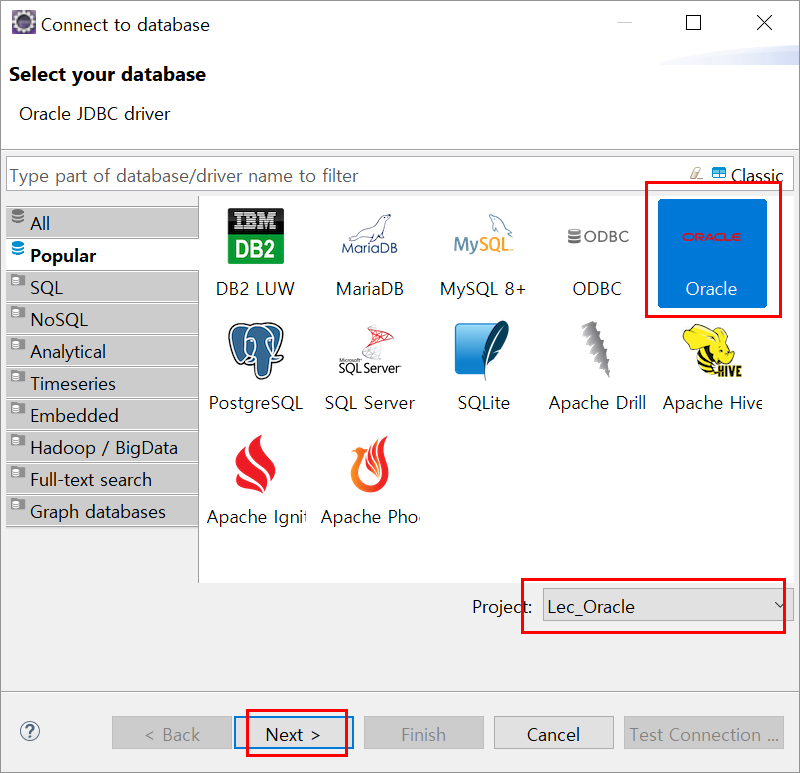
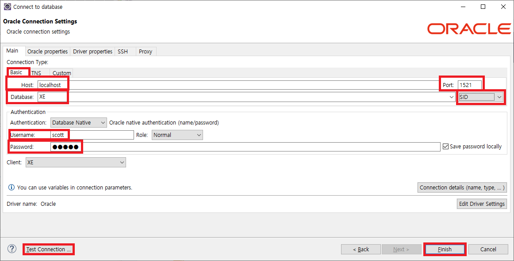
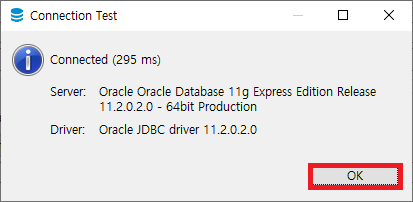

# DBeaver!

이클립스의 기본DatabaseDevelopment 환경의 빈약한 문제

- 최신 DBMS, 다양한 DBMS 지원 느림
- 쿼리 수행속도, 느림.
- 쿼리 Result 화면 빈약

DBeaver 로 극복 가능.

---

## 데이터 베이스 연결 : 프로젝트 단위

> (ex) 오라클의 경우

Project 이름을 확인하고 Next로 진행합니다.

basic 에서 Host 와 Database 의 SID  
Username, password 모든 항목을 꼼꼼이 체크한뒤, Test Connection을 누르면
아래 와 같은 화면이 나오는데, 연결이 성공 된 화면이고, ok로 진행합니다.  
성공적으로 연결이 되면, finish로 진행하여 종료 합니다.
