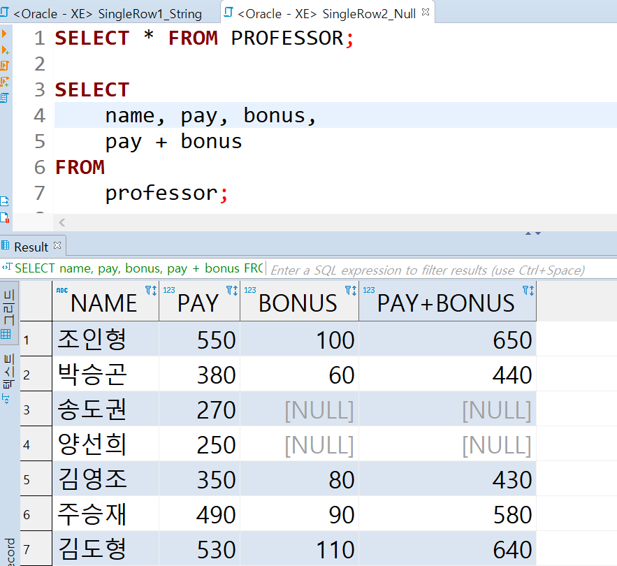
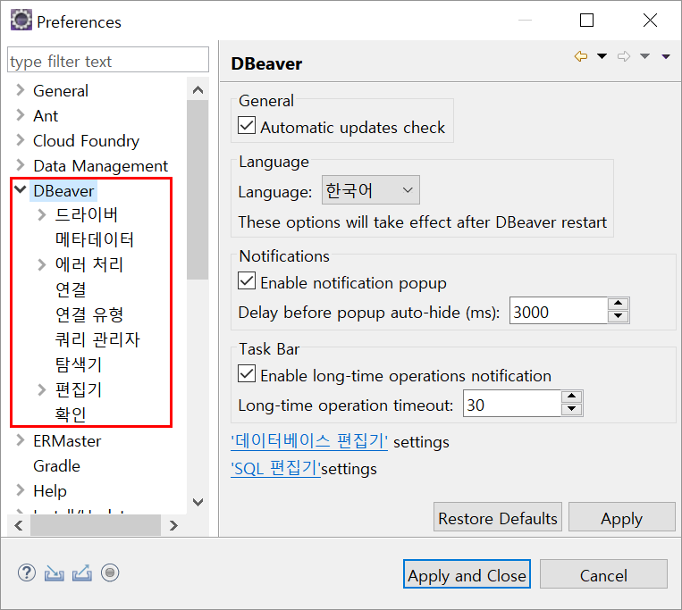
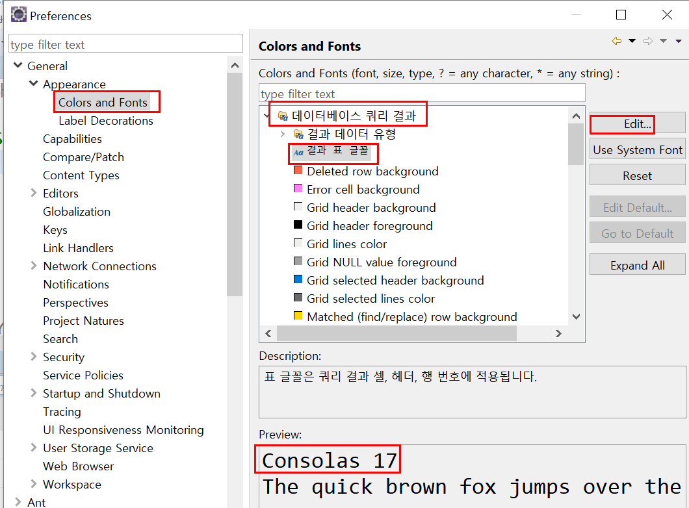
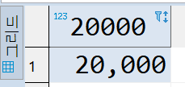
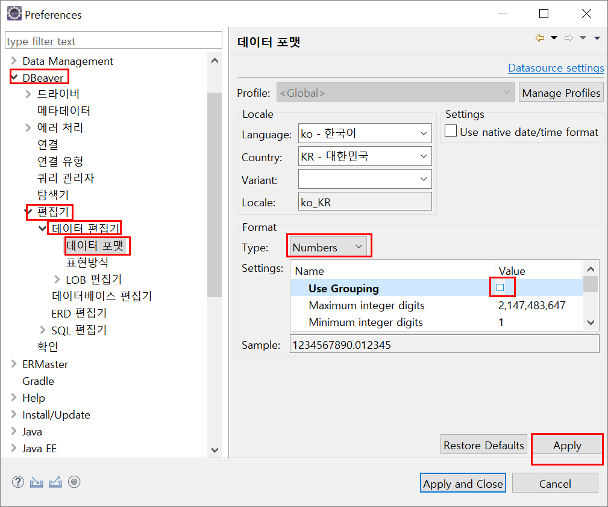
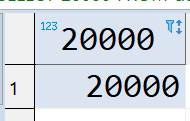
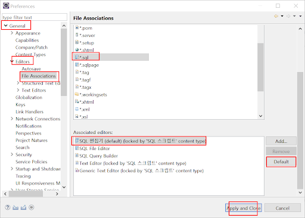
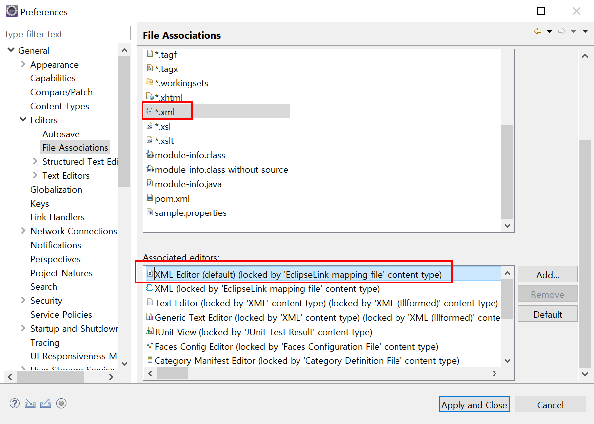
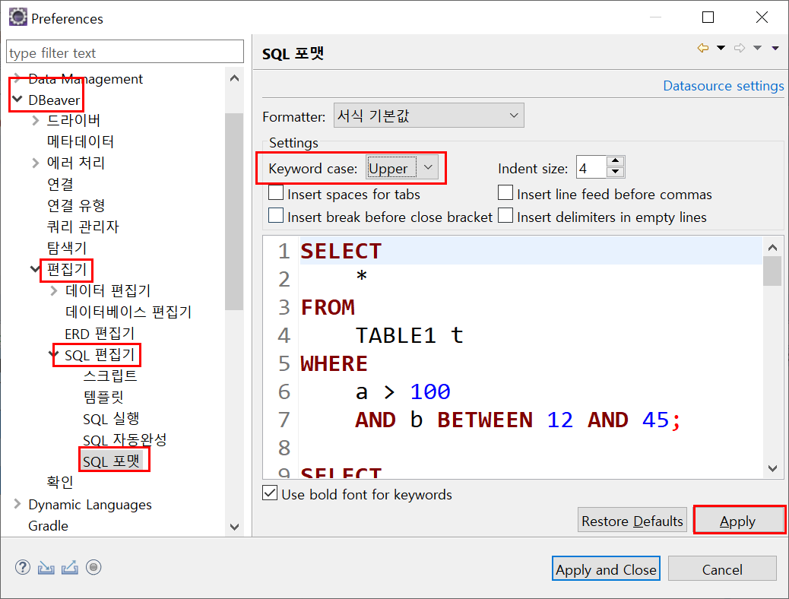
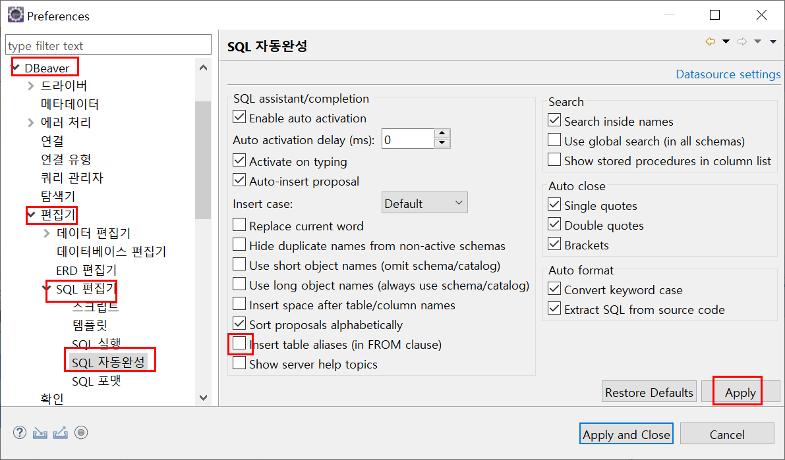

# DBeaver!

이클립스의 기본DatabaseDevelopment 환경의 빈약한 문제

- 최신 DBMS, 다양한 DBMS 지원 느림
- 쿼리 수행속도, 느림.
- 쿼리 Result 화면 빈약

DBeaver 로 극복 가능.

---

## SQL 파일 추가

> (ex) 오라클의 경우

CREAT - OTHER - SQL File
일단 생성하면 기본 이클립스 환경이 뜨는데, 닫고 다시 열어보자.

---

## 쿼리 실행

> (ex) 오라클의 경우

실행할 쿼리문 위에서
CTRL + ENTER (쿼리 한개 실행)

블럭선택후 해당 선택부분만
CTRL + ENTER 실행 가능
여러개 실행 할때는
여러 쿼리 선택후
ALT + X

---

## DBeaver 관련 세팅

> (ex) 오라클의 경우

Preferences
DBeaver 항목 생김

---

## 결과창 글꼴 변경

> (ex) 오라클의 경우

기본글꼴이 가변폭으로 되어 있을 것이다. 가급적 고정폭 글꼴로 바꾸어줍시다.

---

## 결과창 숫자포맷

> (ex) 오라클의 경우

  
  

기본글꼴이 가변폭으로 되어 있을 것이다. 가급적 고정폭 글꼴로 바꾸어줍시다.

---

## \*.SQL 디폴트

> (ex) 오라클의 경우

SQL 파일 더블클릭시 DBeaver SQL 편집 창이 뜨게 할수 있다.

xml 기본편집기는 기존것이 낳다.

---

## 키워드는 대문자로 보이게 하기

> (ex) 오라클의 경우

---

## 테이블 자동 별명 삽입 끄기

> (ex) 오라클의 경우

