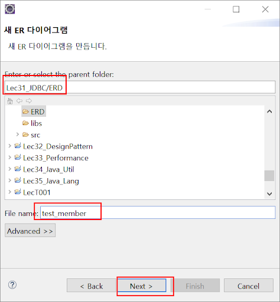
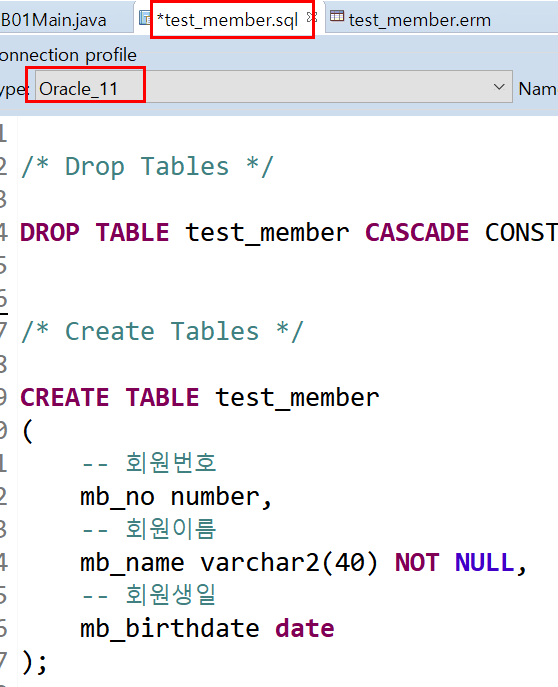

# ERMaster 설치

## ER Diagram

Entity (개체) , Ralationship(관계) 모델 : 데이터를 설계하는 대표적인 모델

ER Diagram : ER 모델을 시각적으로 표현한 것
일반적으로 RDBMS 에서 의 테이블 객체와 속성(컬럼) 그리고 관계들을 설계할때 많이 사용.

ERDiagram( 줄여서 ERD) 는 단독 응용프로그램으로도 있고, 온갖 IDE 에서 지원하고, 웹상에서 제공되는 서비스도 많다.
이클립스도 다양한 ERD 플러그 인들이 제공된다.

---

## 사용

file > new > Other

경로 확인 후 파일명을 입력 하여 Next로 진행합니다.

사용하고자 하는 데이터 베이스를 선택하고 finish 로
ERMaster 파일을 생성합니다.

---

## 테이블 생성

탭에서 테이블을 선택한뒤, 모눈종이(?) 처럼 되어 있는 곳에서 드래그를 하여, 테이블을 생성할 수 있습니다.

생성된 테이블을 더블클릭하면, 테이블정보를 입력하는 frame이 나오게 됩니다.

추가를 눌러 컬럼 정보 입력을 진행 할 수 있습니다.

---

## 컬럼 정보 입력

물리명은 실제로 데이터베이스에서 사용될 naming이고, 논리명은 물리명을 쉽게 정의하는 naming입니다. 즉, logical_name 입니다.

---

## 테이블 생성 완료

---

## 내보내기 (export)

테이블에서 우클릭후 내보내기에서
DDL 형식으로 내보내면 우리가 흔히 알고 있는 .sql 파일로 생성이 되게 됩니다.

파일명을 지정한뒤, OK를 눌러 .sql 파일을 생성합니다.

DBeaver 과 연동하여, 실제로 Database에 등록 할 수 있습니다.

---

## 시퀀스 추가(AUTO_INCREMENT)

---

## 쿼리 전체 실행 : Database 에 Connected 되어 있는 상태여야 합니다.

쿼리문에서 우클릭후, SQL 스크립트 실행 으로 전체 쿼리를 실행 할 수 있습니다.

> `이때! 오류 메시지가 나올 수 있는데, 그 이유는 쿼리문 자체가 처음에 DROP으로 테이블을 지우고 가기 때문입니다. 따라서, 지울 테이블이 없는데, 지우려고 하니 오류가 발생하고 이때 SKIP을 눌러서 무시하고 계속 진행하면 되겠습니다.`

## 커맨드 창에서 확인해봅니다.

테이블과 시퀀스가 제대로 생성되었는지 커맨드 창에서 확인 해 봅시다.!
