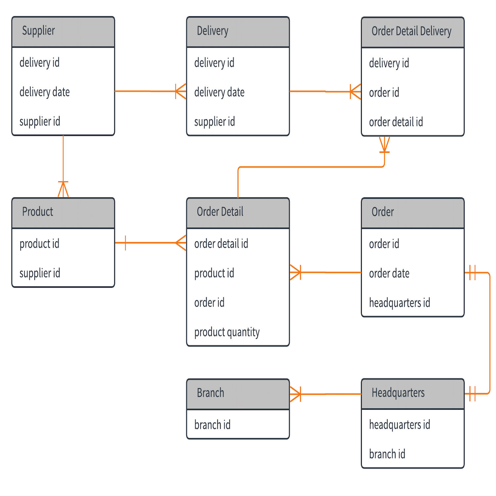
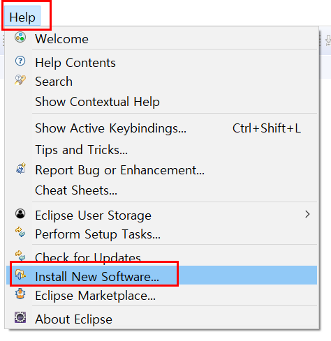
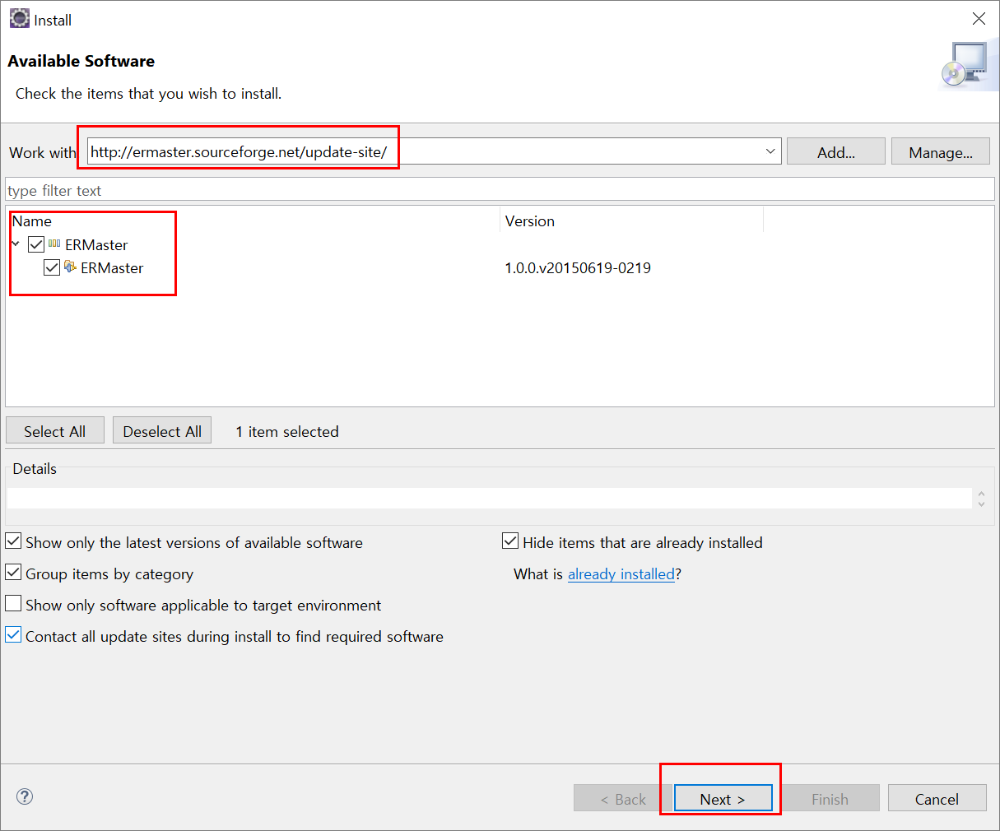
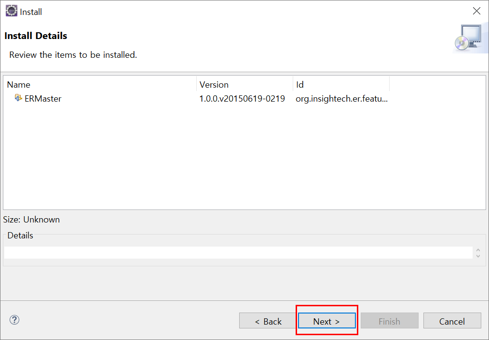
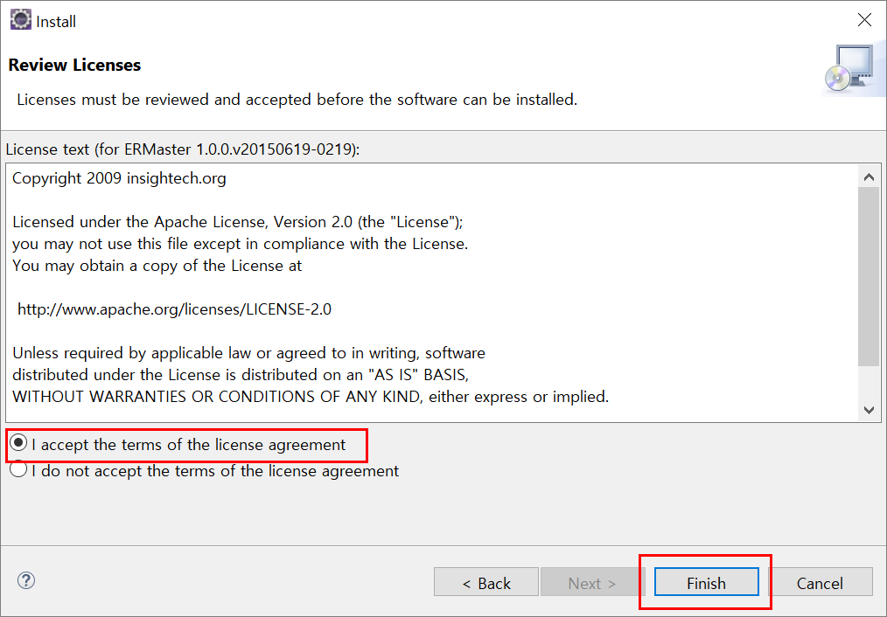

# ermaster 설치

## ER Diagram

Entity (개체) , Ralationship(관계) 모델 : 데이터를 설계하는 대표적인 모델

ER Diagram : ER 모델을 시각적으로 표현한 것
일반적으로 RDBMS 에서 의 테이블 객체와 속성(컬럼) 그리고 관계들을 설계할때 많이 사용.

ERDiagram( 줄여서 ERD) 는 단독 응용프로그램으로도 있고, 온갖 IDE 에서 지원하고, 웹상에서 제공되는 서비스도 많다.
이클립스도 다양한 ERD 플러그 인들이 제공된다.

---

## 설치

Work with 부분에 http://ermaster.sourceforge.net/update-site/ <= URL 을 삽입후 엔터를 눌러 진행합니다.

REMaster의 체크 box에 체크 한뒤 Next로 진핸합니다.

Next 로 진행합니다.

동의 후 finish 로 마무리 합니다.
