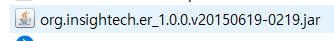
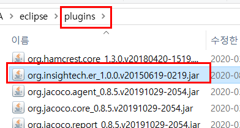
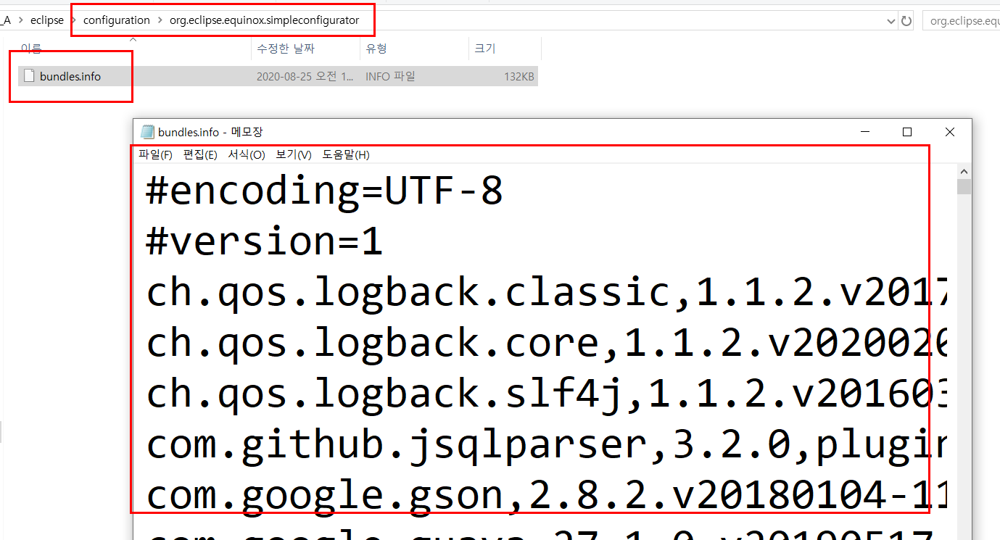
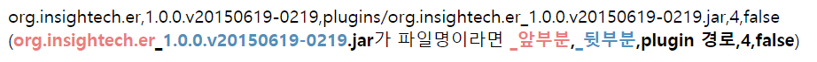
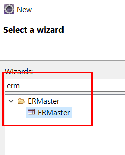

# ERMaster 수동 설치

## ER Diagram

Entity (개체) , Ralationship(관계) 모델 : 데이터를 설계하는 대표적인 모델

ER Diagram : ER 모델을 시각적으로 표현한 것
일반적으로 RDBMS 에서 의 테이블 객체와 속성(컬럼) 그리고 관계들을 설계할때 많이 사용.

ERDiagram( 줄여서 ERD) 는 단독 응용프로그램으로도 있고, 온갖 IDE 에서 지원하고, 웹상에서 제공되는 서비스도 많다.
이클립스도 다양한 ERD 플러그 인들이 제공된다.

---

## 설치

Install New Software 로 설치 안되는 경우

https://sourceforge.net/projects/ermaster/
일단, 수동으로 다운로드 받습니다.

다운로드 받은 파일 → 이클립스/plugins 에 복사 합니다.

이클립스\configuration\org.eclipse.equinox.simpleconfigurator\bundles.info 해당 경로의 파일을 열어주도록 합니다.

맨 아래 아래 줄 추가 할 수 있도록 합니다.

org.insightech.er,1.0.0.v20150619-0219,plugins/org.insightech.er_1.0.0.v20150619-0219.jar,4,false

추가 하셨다면 저장하고 이클립스 를 시작 합니다.

위와 같이 ERMaster가 생성 되었다면 설치 성공!!
